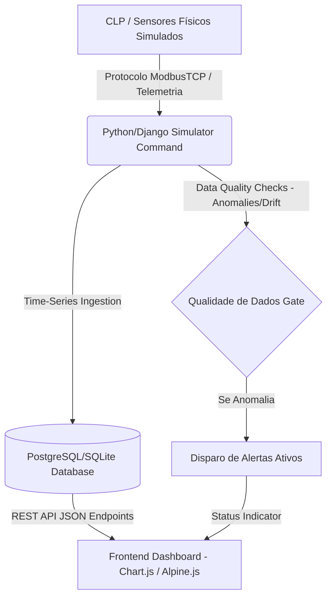

# 🎛️ LabTelemetry: Industrial IoT & SCADA Dashboard

O **LabTelemetry** é uma plataforma que integra a camada física de automação industrial (**Tecnologia da Operação - OT**) com a camada analítica moderna de sistemas web (**Tecnologia da Informação - IT**). 

O projeto simula e monitora uma Estação de Tratamento de Efluentes/Água Química, coletando séries temporais de sensores físicos, aplicando validações de qualidade e exibindo indicadores gerenciais e alarmes ativos.

Para entender de onde o projeto surgiu e quais diretivas guiaram os primeiros rascunhos, veja [docs/origem_do_projeto.md](docs/origem_do_projeto.md).

---

## 🏗️ Arquitetura do Sistema



---

## 🛠️ Stack Tecnológica

*   **Core Backend & API:** Python 3.12, Django 5
*   **Banco de Dados:** SQLite (Desenvolvimento local) / PostgreSQL (Produção)
*   **Ingestão de Séries Temporais:** Django Custom Management Commands
*   **Visualização:** Vanilla CSS, Alpine.js, Chart.js
*   **Infraestrutura e Virtualização:** Docker, Docker Compose

---

## 📊 Modelagem do Banco de Dados (Camada TI)

O banco de dados foi modelado para suportar séries temporais de alta frequência e conformidade técnica (ISO 17025):

1.  **`TelemetrySensor`**: Cadastro dos instrumentos da planta (ex: pH, Turbidez, TOC), incluindo fatores de calibração e estado de saúde (`HEALTHY`, `DRIFTING`, `FAILED`).
2.  **`TelemetryReading`**: Armazena as leituras brutas (*raw_value*), valores compensados após a calibração analítica (*calibrated_value*) e status da medição.
3.  **`TelemetryAlert`**: Gerenciamento de incidentes operacionais ativos quando limites de segurança ou desvios de calibração (*drift*) são detectados.

---

## 🚀 Como Executar o Projeto (Semana 1)

### Pré-requisitos
* Python 3.12+ instalado na máquina.
* Django 5+ instalado no ambiente Python.

### Executando os Passos Iniciais

1. **Entrar no diretório do projeto Django:**
   ```bash
   cd labtelemetry
   ```

2. **Aplicar as migrações para inicializar o banco de dados local:**
   ```bash
   python manage.py migrate
   ```

3. **Criar um superusuário para acessar o painel administrativo do Django:**
   ```bash
   python manage.py createsuperuser
   ```

5. **Iniciar o servidor de desenvolvimento:**
   ```bash
   python manage.py runserver
   ```
   Acesse o painel do Django Admin em: `http://127.0.0.1:8000/admin/` para gerenciar os sensores e alertas cadastrados.
