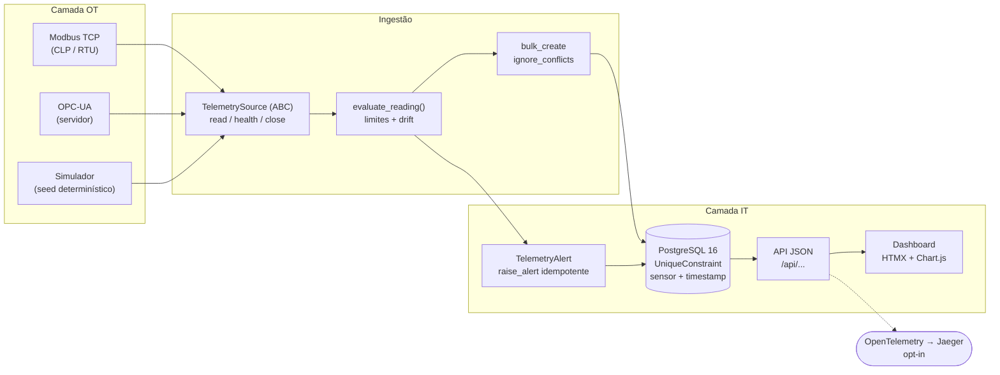
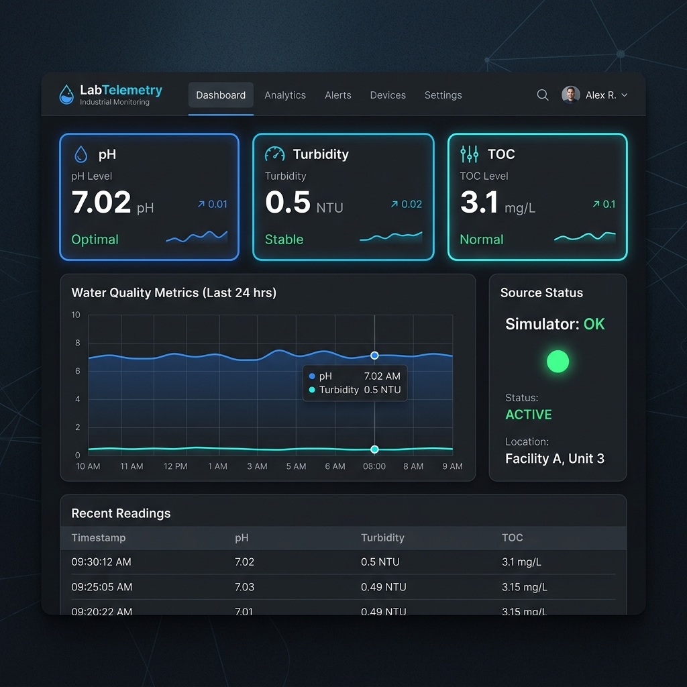

<div align="center">

# 🧪 LabTelemetry

[](https://github.com/Roberton003/labtelemetry/actions/workflows/ci.yml)
[](https://www.python.org/)
[](https://www.djangoproject.com/)
[](https://www.postgresql.org/)
[](https://www.docker.com/)
[](https://opentelemetry.io/)
[](LICENSE)


<p align="center"><b>Laboratório de telemetria OT/IT reproduzível: ingestão industrial (Modbus TCP, OPC-UA, simulador determinístico), regras de qualidade de processo, API JSON e dashboard operacional.</b></p>

</div>

---

## 📌 Project Highlights

- **Idempotência garantida pelo banco, não pela aplicação.** A deduplicação vem de `UniqueConstraint(sensor, timestamp)` combinada com `bulk_create(ignore_conflicts=True)` — uma checagem por lote dentro do Postgres, em vez de um `SELECT` por amostra vindo do Python. O guardrail tem [teste negativo](labtelemetry/telemetry/test_ingest_telemetry.py): sem o mecanismo, o replay estoura `IntegrityError`.
- **Fontes OT plugáveis atrás de uma única ABC.** `TelemetrySource` define `read()`/`health()`/`close()`; Modbus TCP, OPC-UA e simulador são intercambiáveis via `--source`. Adicionar um protocolo não toca o código de ingestão.
- **Mapeamento tag→ponto é configuração explícita, não convenção.** Node OPC-UA e registrador Modbus são ligados ao sensor por `--opcua-node "ns=2;i=101:3"` e `--modbus-register "0:3:0.01"`. Índice posicional não é chave primária de sensor — tratá-lo como tal produz dado plausível e errado, então o comando exige o mapeamento em vez de adivinhar.
- **Fator de escala como cidadão de primeira classe.** Holding register é uint16: um pH de 7.40 não cabe nele. O CLP publica `740` e o mapeamento diz como voltar à grandeza física. Sem isso a leitura entra como pH 740 — fora de faixa, e errada de um jeito que só aparece no gráfico.
- **Simulador determinístico por seed.** Reproduzir uma sequência de falha é `--seed 42`, não "esperar o sensor falhar de novo" — o que torna o teste das regras de qualidade repetível.
- **Observabilidade opcional em runtime.** OpenTelemetry é ligado por `OTEL_ENABLED`; desligado, o custo é zero e nenhuma dependência de trace entra no caminho da request.
- **Qualidade de processo separada da persistência.** `evaluate_reading()` é pura (sem I/O), o que permite avaliar o lote inteiro em memória antes de um único INSERT.
- **Degradação explícita, não silenciosa.** Se `pymodbus` não está instalado ou o CLP está fora do ar, `/api/health/sources/` reporta `disconnected` — a fonte não some do inventário.

---

## 🏛️ Architecture & Tech Stack

| Camada | Tecnologia |
|---|---|
| Aquisição OT | Modbus TCP (`pymodbus`), OPC-UA (`asyncua`), simulador determinístico |
| Ingestão | Django management command (`ingest_telemetry`), lote com `bulk_create` |
| Qualidade | Regras de limite de processo e detecção de drift (`telemetry/quality.py`) |
| Persistência | PostgreSQL 16 (Docker Compose); SQLite como fallback local |
| Backend | Django 5.2 / Python 3.12 |
| API | Endpoints JSON server-side, sem framework REST adicional |
| Frontend | Django Templates + HTMX + Chart.js |
| Observabilidade | OpenTelemetry → Jaeger (opt-in via `OTEL_ENABLED`) |
| Runtime | Docker + Gunicorn |
| Qualidade de código | ruff, 85 testes Django, gate de cobertura em 85%, CI no GitHub Actions |
| Reprodutibilidade | Dependências fixadas exatamente, diretas e transitivas |

---

## 🗺️ Architecture Diagram


```mermaid
flowchart LR
    subgraph OT["Camada OT"]
        MB["Modbus TCP<br/>(CLP / RTU)"]
        UA["OPC-UA<br/>(servidor)"]
        SIM["Simulador<br/>(seed determinístico)"]
    end

    subgraph ING["Ingestão"]
        ADP["TelemetrySource (ABC)<br/>read / health / close"]
        QA["evaluate_reading()<br/>limites + drift"]
        BULK["bulk_create<br/>ignore_conflicts"]
    end

    subgraph IT["Camada IT"]
        DB[("PostgreSQL 16<br/>UniqueConstraint<br/>sensor + timestamp")]
        API["API JSON<br/>/api/..."]
        DASH["Dashboard<br/>HTMX + Chart.js"]
        ALERT["TelemetryAlert<br/>raise_alert idempotente"]
    end

    OTEL(["OpenTelemetry → Jaeger<br/>opt-in"])

    MB --> ADP
    UA --> ADP
    SIM --> ADP
    ADP --> QA --> BULK --> DB
    QA --> ALERT --> DB
    DB --> API --> DASH
    API -.-> OTEL
```

---

## 📊 O Dashboard

<p align="center">
  
</p>

Renderizado pelo Django, atualizado por HTMX em fragmentos parciais (cards, leituras, alertas, sensores, saúde das fontes) — sem SPA e sem build step de frontend.

### Endpoints da API

| Endpoint | Retorno |
|---|---|
| `GET /api/summary/` | Contagens agregadas e timestamp da última leitura |
| `GET /api/sensors/` | Inventário de sensores com fator de calibração |
| `GET /api/readings/recent/` | Últimas leituras (`?limit=`, teto de 500) |
| `GET /api/sensors/<id>/readings/` | Série temporal de um sensor |
| `GET /api/alerts/active/` | Alertas operacionais ativos |
| `GET /api/health/sources/` | Estado de conexão de cada fonte OT |

Contrato completo em [docs/data-contract.md](docs/data-contract.md).

---

## 🚀 Quick Start & Setup

**Pré-requisitos:** Python 3.12+, Docker Compose.

### Subir tudo com Docker

```bash
git clone https://github.com/Roberton003/labtelemetry.git
cd labtelemetry
cp .env.example .env
docker compose up --build -d
```

Dashboard em http://127.0.0.1:8000/ · Jaeger em http://localhost:16686

> Já tem um Postgres ou um collector OTLP local ocupando as portas? Sobrescreva sem editar o compose:
> `POSTGRES_PORT=55432 OTLP_GRPC_PORT=54317 OTLP_HTTP_PORT=54318 docker compose up -d`

### Rodar localmente (SQLite, sem Docker)

```bash
python3 -m venv .venv && source .venv/bin/activate
pip install -r requirements.txt
cp .env.example .env

python labtelemetry/manage.py migrate
python labtelemetry/manage.py runserver 127.0.0.1:8000
```

### Gerar telemetria

```bash
# Uma leitura de cada sensor, a partir do simulador determinístico
python labtelemetry/manage.py ingest_telemetry --source simulator --once --sim-count 3

# Loop contínuo a cada 5s (Ctrl+C encerra de forma limpa)
python labtelemetry/manage.py ingest_telemetry --source simulator --interval 5

# Fonte industrial real — Modbus TCP
# registrador 0 -> sensor 1, com escala: o CLP publica 740, o pH é 7.40
python labtelemetry/manage.py ingest_telemetry --source modbus \
  --modbus-host 192.168.0.10 \
  --modbus-register "0:1:0.01" \
  --modbus-register "4:2:0.1"

# Fonte industrial real — OPC-UA (cada node mapeado ao sensor que alimenta)
python labtelemetry/manage.py ingest_telemetry --source opcua \
  --opcua-url opc.tcp://plc.local:4840 \
  --opcua-node "ns=2;i=101:1" \
  --opcua-node "ns=2;i=103:5"

curl -s http://127.0.0.1:8000/api/summary/
```

### Validar

```bash
pip install -r requirements-dev.txt

python labtelemetry/manage.py test telemetry   # 85 testes
ruff check labtelemetry/

# Gate de cobertura (mínimo 85%, atual 89%) — rodar da raiz do repo
coverage run labtelemetry/manage.py test telemetry --exclude-tag=integration
coverage report
```

Os testes marcados `@tag("integration")` sobem um servidor OPC-UA real. Rodam no gate de correção, mas ficam fora da medição de cobertura: sob o tracer do `coverage`, o startup do servidor passa de ~2s para ~56s.

Roteiro completo em [docs/manual_validacao_ponta_a_ponta.md](docs/manual_validacao_ponta_a_ponta.md).

---

## ⚙️ Environment Variables

Todas em `.env` (ver [.env.example](.env.example)):

| Variável | Padrão | Função |
|---|---|---|
| `SECRET_KEY` | chave de dev | Chave criptográfica do Django — **trocar fora de dev** |
| `DEBUG` | `True` | Modo debug |
| `ALLOWED_HOSTS` | `127.0.0.1,localhost` | Hosts aceitos, separados por vírgula |
| `DATABASE_URL` | `sqlite:///db.sqlite3` | Conexão via `dj-database-url`; aceita `postgres://...` |
| `OTEL_ENABLED` | `False` | Liga a instrumentação OpenTelemetry |
| `OTEL_EXPORTER_OTLP_ENDPOINT` | `http://localhost:4318` | Coletor OTLP (Jaeger) |
| `OTEL_SERVICE_NAME` | `labtelemetry` | Nome do serviço nos traces |
| `APP_PORT` / `POSTGRES_PORT` | `8000` / `5432` | Portas publicadas no host pelo Compose |
| `OTLP_GRPC_PORT` / `OTLP_HTTP_PORT` / `JAEGER_UI_PORT` | `4317` / `4318` / `16686` | Portas do Jaeger no host |

---

## 📚 Documentation Resources

| Documento | Conteúdo |
|---|---|
| [docs/overview.md](docs/overview.md) | Escopo do projeto e posicionamento |
| [docs/architecture.md](docs/architecture.md) | Estrutura de runtime e fronteiras entre componentes |
| [docs/api.md](docs/api.md) | Endpoints e contrato público |
| [docs/data-model.md](docs/data-model.md) | Modelo de dados operacional |
| [docs/data-contract.md](docs/data-contract.md) | Contrato de dados, garantias e limitações |
| [docs/replay-idempotency.md](docs/replay-idempotency.md) | O que é garantido no replay — e o que não é |
| [docs/operations.md](docs/operations.md) | Setup e comandos operacionais |
| [docs/manual_validacao_ponta_a_ponta.md](docs/manual_validacao_ponta_a_ponta.md) | Validação end-to-end em terminais paralelos |
| [docs/security.md](docs/security.md) | Fronteira de documentação pública e tratamento de segredos |
| [sql/analytics/](sql/analytics/) | Consultas de frescor, volume e taxa de anomalia |

Aprofundamento na [Wiki do projeto](https://github.com/Roberton003/labtelemetry/wiki).

---

## 🌳 Estrutura do Projeto

```text
labtelemetry/
├── labtelemetry/               # Projeto Django
│   ├── labtelemetry/           # settings, urls, wsgi/asgi (OTel condicional)
│   └── telemetry/              # App único de domínio
│       ├── models.py           # Sensor, Reading (UniqueConstraint), Alert
│       ├── quality.py          # Regras de limite, drift e alerta idempotente
│       ├── views.py            # API JSON + fragmentos HTMX do dashboard
│       ├── sources/            # Adapters OT sob a ABC TelemetrySource
│       │   ├── base.py         # TelemetrySource, TelemetrySample
│       │   ├── modbus.py       # Modbus TCP via pymodbus
│       │   ├── opcua.py        # OPC-UA via asyncua (+ servidor de teste)
│       │   └── simulator.py    # Gerador gaussiano determinístico
│       ├── management/commands/
│       │   ├── ingest_telemetry.py   # Runner: fonte → qualidade → lote
│       │   └── simulate_telemetry.py # Gerador de cenário sintético
│       ├── templates/telemetry/      # Dashboard + parciais HTMX
│       └── test_*.py, tests.py       # 85 testes
├── docs/                       # Documentação pública + wiki-seed
├── sql/analytics/              # Consultas operacionais
├── .github/workflows/ci.yml    # ruff + testes com Postgres 16
├── docker-compose.yml          # app + postgres + jaeger
└── Dockerfile                  # Runtime Gunicorn
```

---

## 🎯 Escopo e Fronteiras

Este repositório é deliberadamente um laboratório local, não uma plataforma de produção generalizada. O que está fora de escopo está fora por decisão, não por omissão:

- Processamento de stream distribuído
- Autenticação de produção na API
- Infraestrutura cloud multi-região
- Garantia formal de *exactly-once* — o comportamento real e seus limites estão em [replay-idempotency.md](docs/replay-idempotency.md)

---

## 📄 License

[MIT](LICENSE) © 2026 Roberto Nascimento
