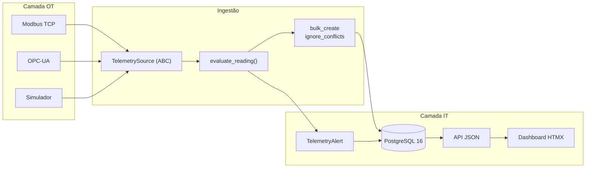

[[Home]] | [[Overview]] | [[Architecture]] | [[Idempotencia-e-Replay]] | [[API]] | [[Operations]] | [[Validation-Guide]]

# 🏛️ Arquitetura

---

## 🧩 Componentes de Runtime

- **`telemetry.sources`** — abstração de fonte. Só conhece protocolo; não sabe que existe banco de dados.
- **`telemetry.quality`** — regras de limite de processo e drift. `evaluate_reading()` é pura; `raise_alert()` toca o banco.
- **`telemetry.management.commands.ingest_telemetry`** — o runner. Único ponto que conhece fonte **e** persistência ao mesmo tempo.
- **`telemetry.management.commands.simulate_telemetry`** — gerador de cenário sintético, independente do runner.
- **`telemetry.models`** — Sensor, Reading e Alert. A constraint de idempotência vive aqui.
- **`telemetry.views`** — endpoints JSON e fragmentos HTMX do dashboard.

---

## 🔌 Adapters de Fonte

**Contrato:** a ABC `TelemetrySource` define três métodos — `read()`, `health()` e `close()` — e uma property `name`. Toda fonte devolve `list[TelemetrySample]`, um dataclass neutro de protocolo.

**Adapters atuais:**

- **`SimulatorAdapter`** — gerador gaussiano por parâmetro, semeado. Caminho reproduzível padrão.
- **`ModbusTCPAdapter`** — host, porta, unit id e timeout configuráveis; lê holding registers via `pymodbus`, cada um mapeado a um sensor com fator de escala próprio.
- **`OpcUaAdapter`** — lê node ids de um servidor OPC-UA via `asyncua`, com servidor de teste incluído.

**Mapeamento tag → ponto:** ambos os adapters de campo recebem o mapeamento explícito — `sensor_ids` no OPC-UA, `RegisterSpec` no Modbus — porque **índice posicional não é chave primária de sensor**. Sem ele, o node/registrador 0 vira "sensor 0": ou não existe, ou é o sensor errado, e o resultado é dado plausível e silenciosamente incorreto. O comando exige o par (`--opcua-node "NODE_ID:SENSOR_ID"`, `--modbus-register "ADDRESS:SENSOR_ID[:SCALE]"`) e recusa iniciar sem ele.

**Escala no Modbus:** holding register é uint16 — um pH de 7.40 não cabe. O CLP publica `740` e o `RegisterSpec.scale` diz como voltar à grandeza física. É a mesma razão pela qual `TelemetrySensor.calibration_factor` existe um nível acima: o mundo físico precisa de ajuste que o modelo mínimo não enxerga. A escala corrige o *protocolo*; a calibração corrige o *sensor*.

**Leitura por registrador, não em bloco:** endereços esparsos tornam a leitura em bloco inválida em muitos CLPs (registrador não mapeado no meio do span). O adapter faz um round trip por ponto configurado — trade-off explícito, com nota de upgrade no código caso o número de pontos cresça.

**Guard de coerência:** se o `parameter` que a fonte reporta (browse name, no caso do OPC-UA) diverge do parâmetro do sensor no banco, `_sample_to_reading()` emite warning sem descartar a leitura — o browse name pode legitimamente divergir, mas mapeamento trocado é a hipótese mais provável.

**Por que a abstração se paga:** o comando de ingestão não tem um único `if` por protocolo no caminho de dados. Adicionar MQTT amanhã é um arquivo novo em `sources/`, não uma edição no runner.

**Degradação:** se `pymodbus` não está instalado ou o CLP está fora do ar, `health()` reporta `disconnected` e `read()` devolve lista vazia. A fonte falha visível, não some.

---

## 🗃️ Modelo de Dados

- **`TelemetrySensor`** — ponto monitorado: nome, parâmetro, status e fator de calibração.
- **`TelemetryReading`** — leitura carimbada, com valor bruto e calibrado, lineage da fonte e status de qualidade. Carrega a `UniqueConstraint(sensor, timestamp)`.
- **`TelemetryAlert`** — alerta operacional ativo ou resolvido.

**Lineage:** cada leitura guarda o nome lógico da fonte (`simulator:seed=42`, `modbus:host:port`) — o suficiente para rastrear origem em consulta, sem preservar o payload bruto do protocolo.

---

## 🎨 Intenção de Design

**Fronteiras pequenas e explícitas:**

- **Avaliação separada de persistência:** `evaluate_reading()` não faz I/O, o que permite avaliar o lote inteiro em memória antes de um único INSERT — e testar as regras sem banco.
- **Garantias no lugar mais barato de enforçar:** a deduplicação é uma constraint de banco, não código de aplicação. Ver [[Idempotencia-e-Replay]].
- **Regras de qualidade no backend**, nunca em query de dashboard — o mesmo status vale para API, UI e alerta.
- **Observabilidade opcional e local-first:** OTel é inicializado condicionalmente no `settings.py`; desligado, nenhuma dependência de trace entra no caminho da request.
- **Sem build step de frontend:** HTMX troca fragmentos renderizados pelo Django. Não há bundler, não há estado duplicado entre cliente e servidor.
